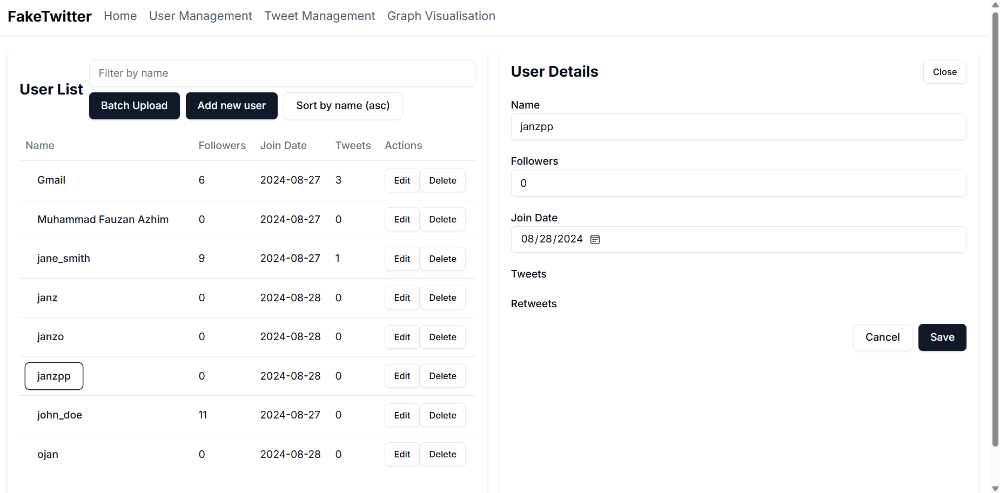
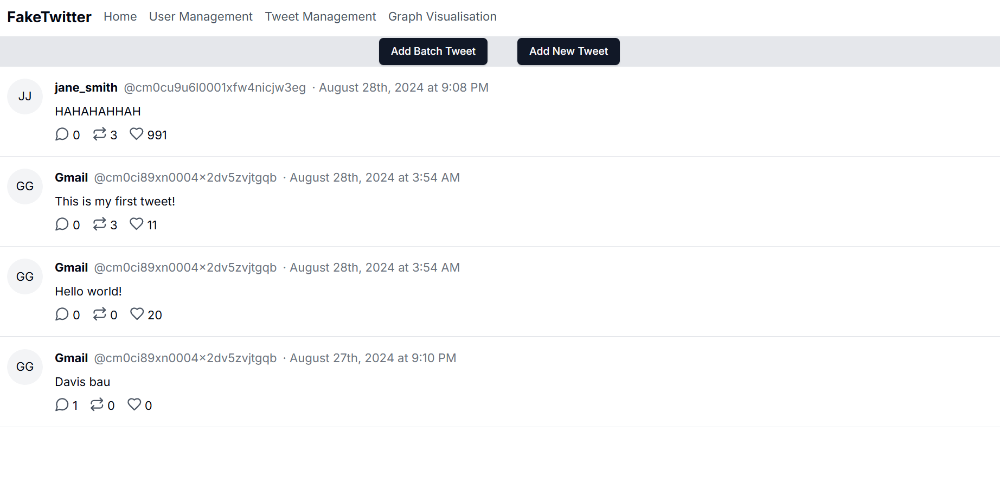
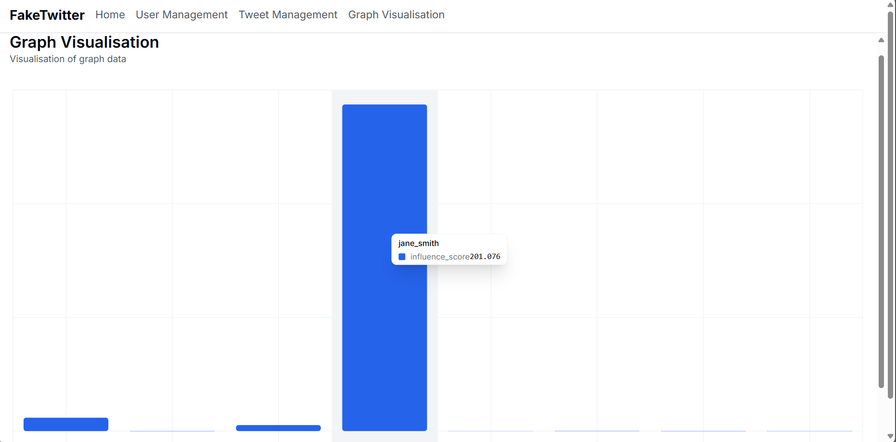

# Influencer Detector  

Influencer Detector adalah simulasi pencarian orang yang paling mempunyai influensi pada suatu media sosial simulasi X. X atau yang dulunya disebut twitter adalah sosial media yang mempunyai komponen likes, retweet, dan reply. Pada simulasi ini kita akan menggunakan eigenvector dalam mencari orang yang paling mempunyai influensi.

## Tech Stack
- Next.js
- ShadCn

## Struktur Program

1. Api : Berisi file yang memuat aksi yang akan dilakukan pada server Python.
3. Component : Berisi file yang memuat komponen-komponen yang digunakan dalam influencer detector.
4. Lib : Berisi file yang berisi fungsi-fungsi digunakanan untuk membantu dalam pembuatan game.
5. Prisma : Berisi file yang berisi konfigurasi database.
6. Public : Berisi Gambar-gambar yang digunakan dalam game.
7. App: berisi file yang memuat tampilan landing page dari game. 
   1. App/graph-visualisation : Berisi file yang memuat tampilan page graf
   2. App/tweet-management : Berisi file yang memuat tampilan page yang mengatur tweet
   3. App/user-management : Berisi file yang memuat tampilan page mengatur user
8. pages : Berisi file yang memuat routing dari influencer detector.
9. REST API : Berisi file yang memuat aksi CRUD pada database

## Komponen Algoritma
- EigenVector Centrality adalah teknik untuk menentukan node yang paling berpengaruh dalam suatu kumpulan node. Dengan cara menghitung bobot yang dimiliki suatu node ke node yang dituju. Semakin banyak hubungan dan semakin besar bobotnya maka semakin berpengaruh node tersebut.
- Pada Influencer Detector kita dapat menggunakan algoritma ini untuk mencari orang yang paling berpengaruh pada suatu hubungan. Dengan memetakan seseorang sebagai node dan simpulnya sebagai hubungan antar orang tersebut dengan orang lain atau komponen yang ada dalam sosial media.
- Untuk faktor-faktor yang digunakan antara lain ada:
  1. Jumlah Followers : Semakin banyak semakin besar potensi pengaruhnya
  2. Jumlah Retweet : Semakin banyak jumlah retweet dari cuitan suatu user maka semakin besar potensi pengaruhnya 
  3. Jumlah Likes : Semakin banyak jumlah likes dari cuitan suatu user maka semakin besar potensi pengaruhnya
  4. Jumlah Reply : Semakin banyak jumlah reply dari cuitan suatu user maka semakin besar potensi pengaruhnya
  5. Umur Akun : Semakin lama umur akun maka semakin besar potensi pengaruhnya
  
## Frontend 
- Cara menjalankan frontendnya adalah dengan:
1. Install Node.js
2. Lakukan instalansi package dengan menggunakan perintah berikut:
```bash
npm install
```
3. Jalankan server dengan menggunakan perintah berikut:
```bash
npm run dev
```
4. Buka browser dan akses `http://localhost:3000/`

- Daftar halaman yang dibuat ada 4
  - Landing Page : Halaman utama yang menampilkan informasi tentang orang yang paling berpengaruh
    
  - User Management : Halaman yang mengatur informasi tentang user
    
  - Tweet Management : Halaman yang mengatur informasi tentang tweet
    
  - Graph Visualisation : Halaman yang menampilkan visualisasi graf
    

## Backend
- Cara menjalankan backendnya adalah dengan:
- Install Python
- Install Requirement dengan menggunakan perintah berikut:
```bash
pip install -r requirements.txt
```
- Jalankan server dengan menggunakan perintah berikut:
```bash
fastapi dev main.py
```
- Daftar endpoint yang dimiliki
- Get /api/data : Mendapatkan data eigenvalue centrality dari database

## Database
- Database yang digunakan adalah SQLite
- 

## References
1. [String Emoji 2 Length](https://stackoverflow.com/questions/38345372/why-does-a-string-containing-a-single-emoji-like-have-a-length-of-2)

## Pembuat
| 13522153 | Muhammad Fauzan Azhim | [LinkedIn](https://www.linkedin.com/in/fauzanazhim/) |
